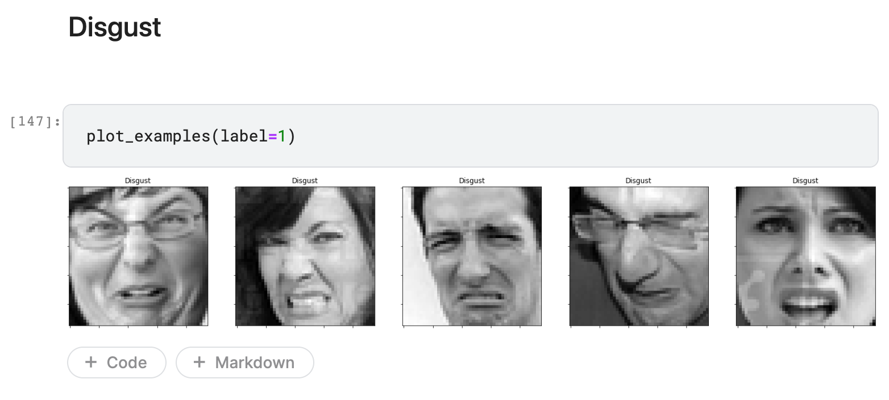
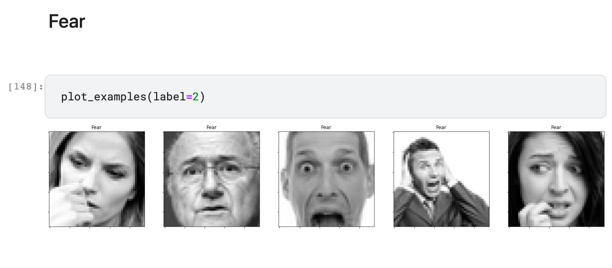

# Video Emotion Classification
 Data Science ML project to affectively classify emotions in Video from Kaggle.com datasets using Pandas Matlotlib Tensorflow

## Case Study 1: Angry Youtube Video

[https://www.youtube.com/watch?v=4Smjpw5MSPM](https://www.youtube.com/watch?v=4Smjpw5MSPM)

## Case Study 2: Happy TikTok Video

[https://www.tiktok.com/@selenagomez/video/7189728750806912298](https://www.tiktok.com/@selenagomez/video/7189728750806912298)

## Case Study 3

https://www.youtube.com/watch?v=PV13SLx3trw

## AI CNN Model

## CNN Model Training Set

## Code Reference

[1] [ Kaggle dataset https://www.kaggle.com/competitions/challenges-in-representation-learning-facial-expression-recognition-challenge/data](https://www.kaggle.com/competitions/challenges-in-representation-learning-facial-expression-recognition-challenge/data)

[2] [ Code Youtube Video https://github.com/mehkey/kaggle/blob/main/projects/emotionsImagePrediction/good-facial-expression-eda-cnn.ipynb](https://github.com/mehkey/kaggle/blob/main/projects/emotionsImagePrediction/good-facial-expression-eda-cnn.ipynb)

